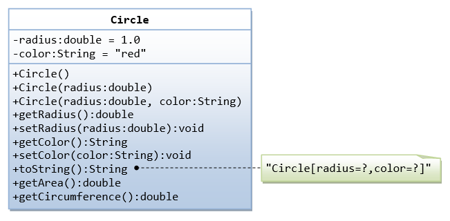

# ***IN THIS REPOSITORY***
---
## 1. A *_class_*,_"**Person**"_ hold with all the details.
---
  * Write a class Person and give objects in constructor 
  * In a block{}, we can use `this.` (it retains the `this` value of the enclosing lexical context). 

for examle,
  ``````
  class Person{
       // Constructor method is called when an object is created based on this class
    constructor(parameter1, parameter2, ...) {
        // Initialization of object properties
        this.property1 = parameter1;
        this.property2 = parameter2;
        // ... other initializations
    }
  }  
``````
and finally declare a `const variableName = new Person()` .Here `new` is keyword for a class Person() ,then console
 

---
## 2. A **class** to _calculate 'Uber price'_.

* Give same as in the above code, After completing initialization of object properties we wanna to invoke a function to calculate the price which i choose.You may choose any other methods to get, what we need.
``````
 calculatePrice(){
        //
        return ; 
 } 
`````````

and declare a variableName and finally print.

``````
I have created html file to get output in console 
``````
##
## 3. Class - Movie
The class Movie is stated below. An instance of class Movie represents a film. This class has the following three properties:

* title, which is a String representing the title of the movie
* studio, which is a String representing the studio that made the movie
* rating, which is a String representing the rating of the movie (i.e. PG­13, R, etc)
1. Write a constructor for the class Movie, which takes a String representing the title of the movie, a String representing the studio, and a String representing the rating as its arguments, and sets the respective class properties to these values.

1. The constructor for the class Movie will set the class property rating to "PG" as default when no rating is provided.

1. Write a method getPG, which takes an array of base type Movie as its argument, and returns a new array of only those movies in the input array with a rating of "PG". You may assume the input array is full of Movie instances. The returned array need not be full.

1. Write a piece of code that creates an instance of the class Movie with the title “Casino Royale”, the studio “Eon Productions”, and the rating “PG­13”

check this above four questions in `movie.js` file
##

# 4.Convert the UML diagram to class:



code in `circle.js` file.

##
# **Thankyou**